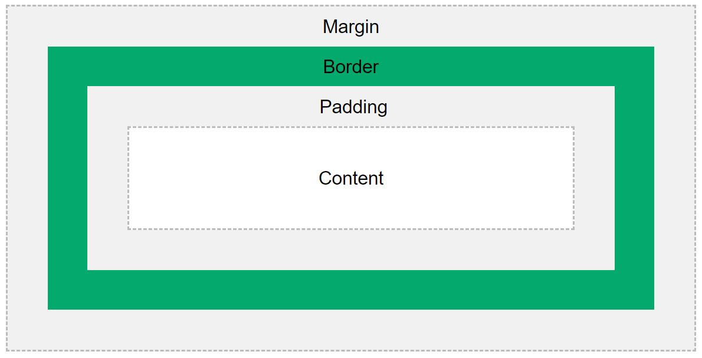
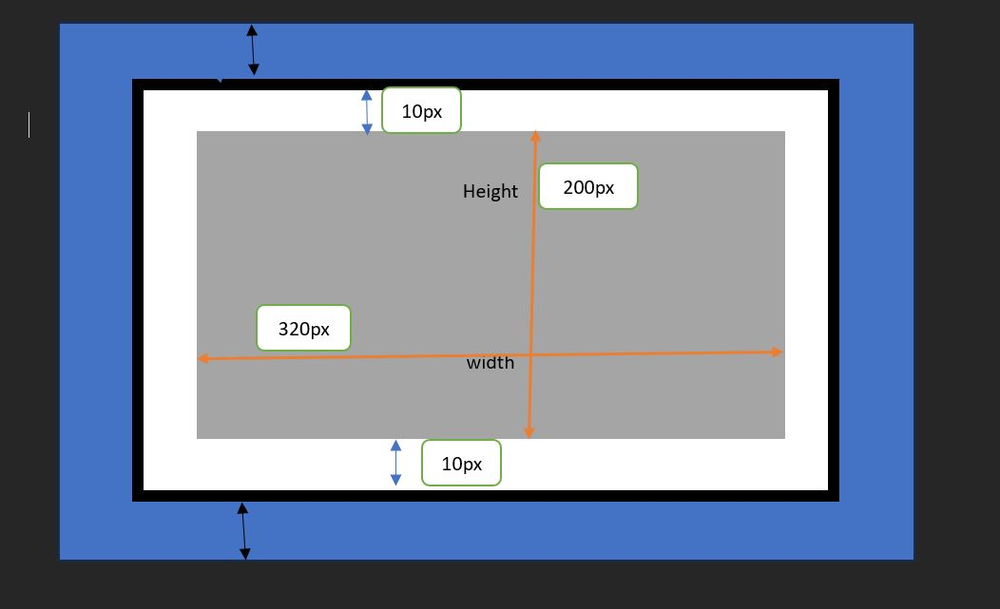
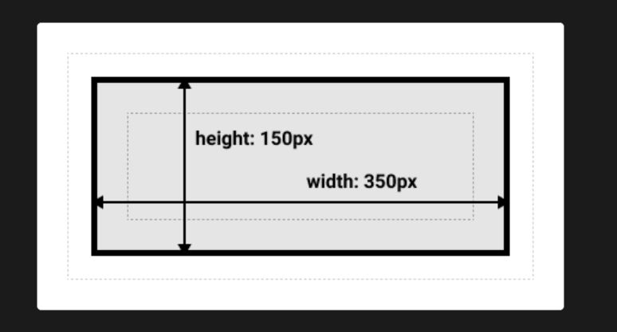
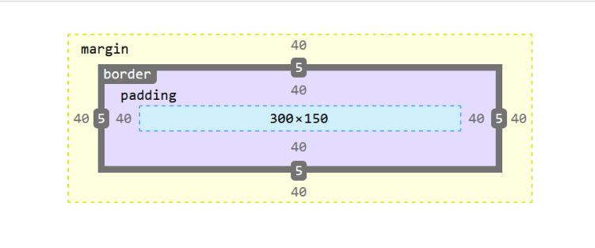

<!-- START doctoc generated TOC please keep comment here to allow auto update -->
<!-- DON'T EDIT THIS SECTION, INSTEAD RE-RUN doctoc TO UPDATE -->
**Table of Contents**  

- [Box model in CSS](#box-model-in-css)
    - [Explanation of the different parts:](#explanation-of-the-different-parts)
    - [Width and Height of an element.](#width-and-height-of-an-element)
  - [Use of developers tools to view the box-model](#use-of-developers-tools-to-view-the-box-model)

<!-- END doctoc generated TOC please keep comment here to allow auto update -->

# Box model in CSS
- In HTML, all the elements can be considered as boxes. In CSS, box-model is used in designing and developing layouts. A box-model is essentially  a box that wraps around every HTML. It consists of: content, padding, borders and margins. The image below illustrates the box model.



### Explanation of the different parts:
1. Margin - The margin is the outermost layer, wrapping the content, padding, and border as whitespace between this box and other elements; size it using ```margin``` and related properties.
1. Content - The area where your content is displayed; size it using properties like ```inline-size``` and ```block-size``` or ```width``` and ```height```.
1. Padding - This is a transparent area that clears an area around the content of the box. Size it using ```padding``` and other related properties.
1. Border-box - Wraps around the content and any padding included. Size it using ```border``` and other related properties. Borders sit on top of the padding and content area and separate the margin area from the padding area.

***Demostration of a Box-model:***
```.css
- CSS

div {
  width: 320px;
  height: 50px;
  padding: 10px;
  border: 5px solid gray;
  margin: 0;
}
```
### Width and Height of an element.
- To define the width and the height of an element, it is crucial that one must understand ho the Box model works.
- **Important:** When you define the width and the hight of an element in CSS, you only set them for the content area. To calculate the total ```width``` and the total ```height```, you have to include the sizes of the padding and the border as well.
- **Important:** Despite that the margin also affects the total space taken up on browser by an element, it is not included in the actual size of the box. The size of the box (```width``` and ```height```) stops at the border of the box.

- The total ```width``` and the total ```height``` of the box model defined above will be computed as follows.

* The total width of an element:
    - Total element ```width``` = ```width```  + ```padding-left```  + ```padding-right```  + ```border-left```  + ```border-right``` 

* The total height of an element:
  - Total element ```heigth```  = ```heigth```  + ```padding-top```  + ```padding-bottom```  + ```border-top```  + ```border-bottom``` 

  

 
  ## The Alternative Box-model
- This alternative argues that the ```width``` and the ```height``` of the box model is the size of the visible box on the page. This size is inclusive of the ```padding``` and the ```border```.

- To set this alternative box-model on any element, use the property ```box-sizing ```: ```border-box```. Example.
```.css
- CSS

.box {
    box-sizing : border-box
}
``` 

- **Demonstration**


## Use of developers tools to view the box-model
- For easier understanding of the box-model, you can inspect an element and use the **DevTools** to view the model. The **DevTools** will help you find out if the  size of the box is the actual size you want.




**Important** As I conclude, it is crucial to note which element apply for the boxing model and which does not apply. This takes us to the concepts of **block-level boxes** and **inline boxes**. There is list of differences between the two, and mastering how they work will simplify your work in developing ```CSS``` layouts.
- Block elements occupy the full width of their parent element, stacking on top of each other. They include elements such as ```<p>```,```<div>```, ```<li>```, ```<nav>```, ```<ul>```, ```<ol>```, ```<nav>```.
- Inline elements only take up the space necessary for their content, sitting on the same line. Example of elements are ```<a>```, ```<i>```, ```<span>```, ```<button>```.